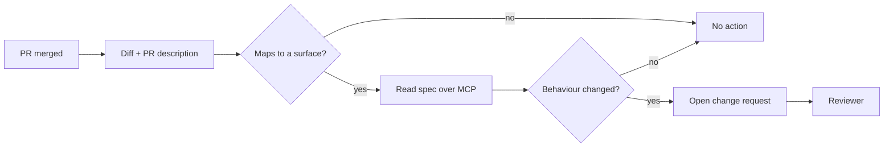

# Docs in pull requests

## What it does

When a pull request merges in a product repository, the docs agent checks whether the diff
changes behaviour that a spec describes. If it does, the agent opens a change request
against the knowledge base with a minimal diff.



## How a PR maps to a spec

The mapping is explicit, not inferred. Two mechanisms:

| Mechanism | How | When to use |
|---|---|---|
| `docs:` label with a surface | `docs:hily/monetisation` on the PR | Preferred — unambiguous |
| Path mapping | `.github/docs-map.yml` in the product repo | For repos with stable module boundaries |

```yaml
# .github/docs-map.yml
surfaces:
  - paths: ["Paywall/**", "Subscription/**"]
    surface: hily/monetisation
  - paths: ["Onboarding/**"]
    surface: hily/onboarding
  - paths: ["Discovery/**", "Ranking/**"]
    surface: hily/discovery
```


**An unmapped PR produces no change request, silently.** That is deliberate — noisy false
positives killed the first version of this workflow. The cost is that a new module needs a
line in `docs-map.yml`, and the quarterly spec audit is what catches the ones nobody added.


## What the agent proposes

| Change kind | Agent behaviour | Typical review |
|---|---|---|
| Config default changed | Updates the Configuration table row | Skim |
| New condition branch | Adds a row to the Behaviour table | Skim |
| Condition removed | **Flags it, does not delete** | Read carefully |
| New surface added | Drafts a new spec from the template | Full review |
| Copy or threshold change | Updates the value in place | Skim |


**The agent never deletes a behaviour row on its own.** It adds a comment on the change
request saying "this row may be superseded by the diff" and leaves the decision to the
reviewer. Deletion is where agents are least reliable and where a wrong call is most
expensive.


## Reviewing an agent change request

Four questions, in order:

1. Does the diff match what actually shipped, not what the PR description claimed?
2. Is anything now **contradicted** by the new rows and still on the page?
3. Are the `reviewed` date and `status` updated?
4. Does it need a changelog entry, and is one included?

Approve with edits rather than sending it back. The round trip is what makes people stop
using the workflow.

## Opting a repository in



### Install the GitBook app on the repository

Read access to diffs and PR metadata only.



### Add `.github/docs-map.yml`

Or agree to use `docs:` labels exclusively. Both is fine; the label wins on conflict.



### Nominate a reviewer group

Change requests are routed to the surface owner from the spec's frontmatter. A surface with
no owner gets routed to <code class="expression">space.vars.docs_owner</code>, which is a
signal the spec is orphaned.


