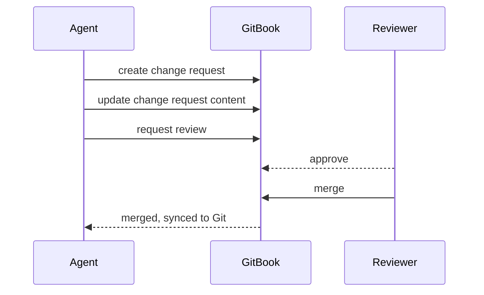

# MCP connector

The knowledge base is exposed over the Model Context Protocol. An agent connected this way
can search, read pages, and — with the right role — open change requests.

## Connecting



```json
{
  "mcpServers": {
    "appflame-kb": {
      "url": "https://appflame.gitbook.io/kb/~gitbook/mcp"
    }
  }
}
```

Authentication happens in the browser on first connection, against the same SSO that gates
the site. An employee who cannot open the site cannot read it over MCP either.



Service agents authenticate with a GitBook API token scoped to the organisation, stored in
the platform secret manager. Never in a repository, never in a prompt.

```bash
export GITBOOK_TOKEN="$(vault read -field=token secret/gitbook/docs-agent)"
```

Token roles are listed below. The docs agent uses `write`; anything that only reads gets
`read`.



For agents that only need a machine-readable index rather than a live connection:

```
https://appflame.gitbook.io/kb/llms.txt
https://appflame.gitbook.io/kb/llms-full.txt
```

Any page can also be fetched as raw Markdown by appending `.md` to its URL — which is the
fastest way to check what the importer actually kept.



## What an agent can do, by role

| Capability | `read` | `write` |
|---|---|---|
| Search across all spaces | ✅ | ✅ |
| Read any page as Markdown | ✅ | ✅ |
| Read the site structure | ✅ | ✅ |
| Open a change request | ❌ | ✅ |
| Edit content in a change request | ❌ | ✅ |
| Merge a change request | ❌ | `changelog/**` only |
| Delete a page | ❌ | ❌ |


**Write tokens are not handed out per person.** There is one write token, held by the docs
agent, and its permitted surfaces are enforced server-side. An engineer who wants an agent
to propose docs changes uses the [PR workflow](docs-in-pull-requests.md), which runs as the
docs agent.


## Typical read patterns

| Task | How the agent should do it |
|---|---|
| "What does the Hily paywall do?" | Search `hily paywall`, read the spec page whole |
| "Is anything being tested on this surface?" | Read the spec's frontmatter `status`, then follow the Related section |
| "What changed last week?" | Read the Changelog space, newest entries first |
| "How is D7 retention defined?" | Read `analytics/foundations/metric-definitions.md` — never infer a definition |
| "Which specs does EXP-2026-114 affect?" | Read the experiment's `affects:` frontmatter |

## Write pattern

An agent never edits content directly. The sequence is always:




**One change request per logical change**, touching every affected page. Three change
requests for one PRD produce three partial reviews and one inconsistent knowledge base.

