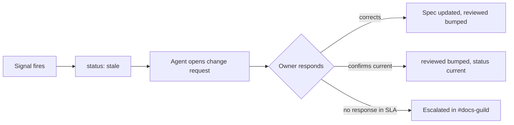

# Staleness and content gaps

Two different failure modes, two different detection mechanisms. Both were invisible to us
in Confluence, which is a large part of why we moved.

## Staleness — pages that are no longer true

A page is stale when the behaviour it describes no longer matches production. Nothing about
the page itself changes when this happens, which is what makes it hard.

### The three signals

| Signal | Source | Confidence |
|---|---|---|
| `reviewed` date older than 90 days | Frontmatter | Low — a prompt, not a verdict |
| Merged PR touching a mapped surface with no doc change | GitHub | Medium |
| Concluded experiment whose `affects:` specs were not updated | This knowledge base | **High** |


**The experiment signal is the strongest one we have**, and it is the reason experiments
live in the knowledge base rather than in Jira. An experiment that shipped and whose
affected specs are unchanged is a near-certain staleness hit — the behaviour provably
changed and the documentation provably did not.


### What happens when a page is flagged

The agent may **set** a staleness flag. It may never clear one — only a human confirming
the page resets `status` and `reviewed`. Otherwise the agent that guessed wrong about
staleness would also be the one deciding it had been wrong.

## Content gaps — questions with no answer

A content gap is a question people or agents ask that no page answers.

### Where gaps come from

| Source | What it reveals |
|---|---|
| AI assistant questions with no confident answer | The most direct signal available |
| Repeated Slack questions on the same surface | The page exists but is not findable, or is incomplete |
| Assistant answers the user marked unhelpful | The page exists but is wrong or unclear |
| Searches returning no result | Vocabulary mismatch — often a naming problem, not a missing page |


**A search with no results is usually not a missing page.** It is far more often a
vocabulary mismatch — someone searching "subscription screen" for a page called
"Subscriptions and paywalls". The fix is a better `description`, not a new page.


### The monthly gap review

Once a month, <code class="expression">space.vars.docs_owner</code> reviews:

1. The top unanswered assistant questions
2. Surfaces with the most Slack questions relative to page count
3. Specs with no `reviewed` update in two quarters

Each item becomes one of: a change request, a naming fix, or an explicit "we do not
document this" note. The third option is a legitimate outcome and should be recorded rather
than left as an open gap forever.

## What this does not do yet


**Direct code-to-docs staleness detection is not solved.** We can tell you that a PR touched
a mapped surface and no doc changed, which is a good proxy. We cannot yet tell you that a
specific sentence in a spec contradicts a specific branch in the code.

The practical answer today is the combination that already works: experiment readouts as a
high-confidence signal, PR mapping as a medium one, and the 90-day review clock as a floor.

