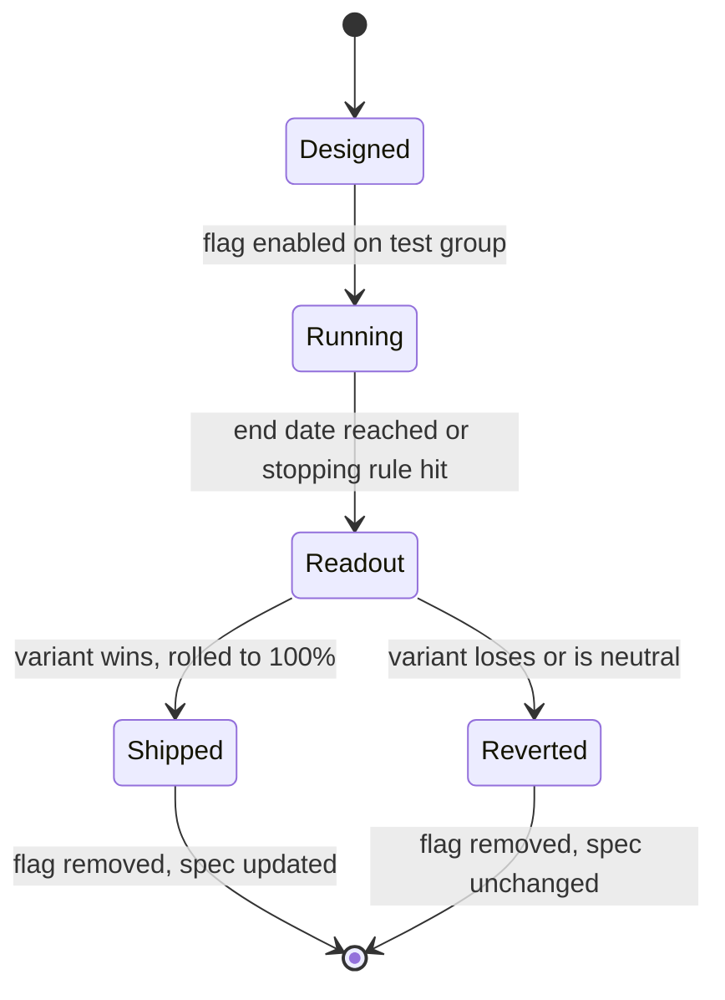

# Experiment lifecycle

## The five states



| State | Page exists? | Spec shows it? | Owner action |
|---|---|---|---|
| Designed | Yes, in `active/` | No | Write hypothesis and metrics |
| Running | Yes | Yes — spec marked `under-test` | Nothing until end date |
| Readout | Yes | Yes | Write the readout section |
| Shipped | Moved to `concluded/` | Spec updated, `under-test` removed | Update spec, changelog entry |
| Reverted | Moved to `concluded/` | `under-test` removed | Changelog entry only |

## What must be written before an experiment starts

An experiment that starts without these is not documented, and its result will not be
interpretable in three months.



### A falsifiable hypothesis

"Moving the paywall later will increase trial starts" — not "improving the paywall
experience". If no result could disprove it, it is not a hypothesis.



### One primary metric, declared up front

Plus at most three guardrail metrics. Declaring the primary metric after seeing the data is
the most common way experiments lie.



### The affected surfaces, in frontmatter

```yaml
affects:
  - product-specs/hily/subscriptions-and-paywalls.md
```

This is what lets the docs agent mark those specs `under-test` automatically, and what lets
a reader on a spec page see that it is being changed.



### A stopping rule and an end date

Both. "We will stop early if the guardrail metric drops more than 3%" and "otherwise we
stop on 2026-10-05". Experiments without an end date run forever and quietly become
permanent untracked behaviour.



## Guardrail metrics

Every experiment declares guardrails — metrics that must *not* move badly, even if the
primary metric wins.

| Surface type | Standard guardrails |
|---|---|
| Onboarding | D1 retention, profile completion rate |
| Discovery | Match rate per session, report rate |
| Monetisation | D7 retention, refund rate |
| Messaging (Mailkeeper) | Unsubscribe rate, push opt-out rate |


**A guardrail breach stops the experiment, regardless of the primary metric.** This is not
a discussion — it is the stopping rule. Reopening requires a new experiment with a new ID.


## Where the result lands

An experiment is not finished when the readout is written. It is finished when:

- [x] The readout section is complete, including the decision
- [x] The page has moved from `active/` to `concluded/`
- [x] Every spec in `affects:` is updated to describe the new production behaviour
- [x] A [changelog](https://appflame.gitbook.io/appflame-knowledge-base/changelog/) entry exists
- [x] The flag is removed — see [rollout and cleanup](rollout-and-cleanup.md)
