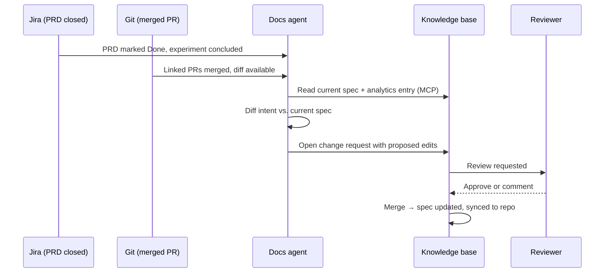

# PRD to docs pipeline

This is the workflow we built to stop documentation drifting behind production. The agent
does the drafting; the human does the deciding. The split is deliberate and it is enforced
by permissions, not by good intentions.

## The pipeline

## What triggers it

| Trigger | Source | Produces |
|---|---|---|
| PRD moved to Done | Jira webhook | Draft spec update |
| Experiment readout written | This space | Spec update + changelog entry |
| PR merged with `docs:` label | GitHub | Draft spec update |
| Spec `reviewed` date older than 90 days | Scheduled job | Staleness check request |

## What the agent is allowed to do



- Read every space in the knowledge base over MCP
- Read Jira PRDs and merged PR diffs
- Draft edits to `product-specs/**`, `experiments/**`, `analytics/**`
- Open a change request with those edits
- Append entries to `changelog/**` and merge them
- Flag a spec as possibly stale, with its reasoning



- Merge any change request outside `changelog/**`
- Edit `home/**` or `ai-agents/**` at all
- Delete a page
- Change frontmatter `status` from `stale` back to `current`
- Rewrite an experiment's hypothesis or primary metric after it started
- Invent a behaviour that is not evidenced in the PRD, the diff or the readout



## The prompt contract

The agent is given three things and nothing else: the current spec page as Markdown, the
PRD text, and the merged diff summary. It is asked to produce a **minimal diff**, not a
rewrite.


**Minimal diff is the whole trick.** An agent asked to "update the spec" rewrites the page
and produces a review nobody can read. An agent asked to "change only the lines whose truth
value changed" produces a five-line diff a PM can approve in thirty seconds. Review latency
is what kills these pipelines, and diff size is what drives review latency.


## Where a human still has to look

The agent is reliably good at three things and reliably bad at one.

| Task | Agent quality | Review needed |
|---|---|---|
| Updating a threshold or config value | High | Skim |
| Adding a new row to a behaviour table | High | Skim |
| Rewriting a summary paragraph | Medium | Read |
| **Deciding what to delete** | **Low** | **Always** |

Superseded behaviour is the hard part. The agent adds the new case correctly and leaves the
old one in place, because nothing in the PRD says "and the previous rule no longer applies".
Reviewers should read every spec diff with one question: *what should have been removed?*

## Failure modes we have actually hit


A PRD described three variants; only one shipped. The draft described all three as current
behaviour. **Fix:** the agent now receives the merged diff as well as the PRD, and is
instructed that the diff wins where they disagree.



A change touching both onboarding and the paywall produced two change requests with
different descriptions of the same rule. **Fix:** one change request per PRD, touching every
affected spec, so the diff is reviewed as a whole.



The agent flagged a spec stale, the owner confirmed it was current, the agent flagged it
again the next week. **Fix:** confirming a spec updates `reviewed`, which resets the
90-day clock. The agent may not clear a stale flag itself.

