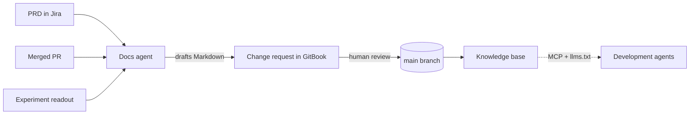

# appflame knowledge base

> Flame up the world with Ukrainian products — and document it properly while you do.

This is the internal knowledge base for **Hily**, **Taimi**, **AdConnect** and
**Mailkeeper**. It is gated behind <code class="expression">space.vars.sso_provider</code>
SSO and visible only to appflame employees.

It exists for two audiences, and it is written for both at once:


{% column width="50%" %}
### 👤 For people

A product manager should be able to land on a feature and understand what it does, who it
is for, and how it is measured — in under five minutes, without opening Jira.


{% column width="50%" %}
### 🤖 For agents

Our development agents read this knowledge base before they touch a feature. Plain
Markdown, predictable frontmatter, explicit links — no rendered widgets they cannot parse.





## Start here

<table data-view="cards"><thead><tr><th></th><th></th><th></th><th data-hidden data-card-target data-type="content-ref"></th></tr></thead><tbody>
<tr>
  <td><h3><i class="fa-layer-group" style="color:$primary;">:layer-group:</i></h3></td>
  <td><strong>Product Specs</strong></td>
  <td>What every feature does, per product. The human layer.</td>
  <td><a href="https://app.gitbook.com/s/XSPACE_SPECS/">Product Specs</a></td>
</tr>
<tr>
  <td><h3><i class="fa-flask" style="color:$primary;">:flask:</i></h3></td>
  <td><strong>Experiments</strong></td>
  <td>What is being tested right now, on which surface, and what we learned.</td>
  <td><a href="https://app.gitbook.com/s/XSPACE_EXPERIMENTS/">Experiments</a></td>
</tr>
<tr>
  <td><h3><i class="fa-chart-line" style="color:$primary;">:chart-line:</i></h3></td>
  <td><strong>Analytics</strong></td>
  <td>Metric definitions and the event taxonomy behind them.</td>
  <td><a href="https://app.gitbook.com/s/XSPACE_ANALYTICS/">Analytics</a></td>
</tr>
<tr>
  <td><h3><i class="fa-robot" style="color:$primary;">:robot:</i></h3></td>
  <td><strong>AI &#38; Agents</strong></td>
  <td>How our agents read and write these docs — MCP, PRs, Slack.</td>
  <td><a href="https://app.gitbook.com/s/XSPACE_AGENTS/">AI and Agents</a></td>
</tr>
<tr>
  <td><h3><i class="fa-clock-rotate-left" style="color:$primary;">:clock-rotate-left:</i></h3></td>
  <td><strong>Changelog</strong></td>
  <td>What shipped, when, and which spec it changed.</td>
  <td><a href="https://app.gitbook.com/s/XSPACE_CHANGELOG/">Changelog</a></td>
</tr>
<tr>
  <td><h3><i class="fa-compass" style="color:$primary;">:compass:</i></h3></td>
  <td><strong>Find anything</strong></td>
  <td>Search, the AI assistant, and how to ask a question well.</td>
  <td><a href="getting-around/find-anything.md">find-anything</a></td>
</tr>
</tbody></table>

## How a change reaches this knowledge base

The agent drafts. A human reviews. Nothing merges unreviewed except changelog entries.
The full pipeline is documented in
[PRD to docs](https://app.gitbook.com/s/XSPACE_AGENTS/workflows/docs-in-pull-requests).

## Conventions in one screen

| Rule | Why |
|---|---|
| One feature, one spec page | Agents retrieve pages, not paragraphs |
| Every spec links to its analytics entry and its experiments | The connections are the knowledge |
| Frontmatter `description` is mandatory | It is what search and the assistant surface first |
| No screenshots as the only source of truth | An agent cannot read a screenshot |
| Deprecated content is deleted, not greyed out | Stale docs are worse than missing docs |

Questions about the knowledge base itself go to
<code class="expression">space.vars.docs_owner</code> in Slack, or
<code class="expression">space.vars.kb_support</code>.
