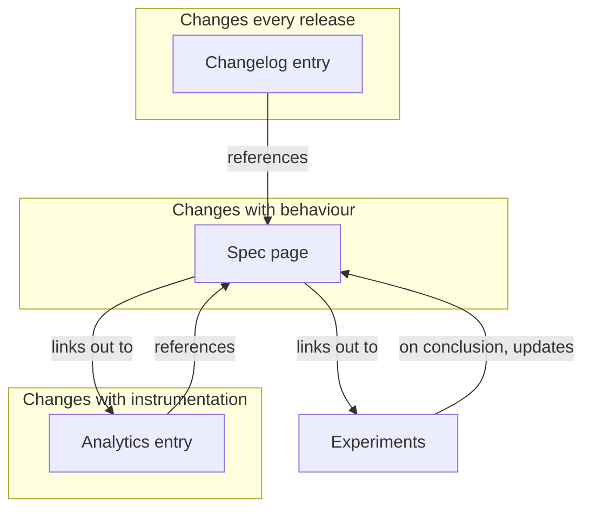

# The documentation model

Every feature in the appflame knowledge base is described by exactly three layers. The
layers live in different spaces, are owned by different people, and change at different
speeds — but they are linked to each other from day one.

## The three layers

<table><thead><tr><th width="150">Layer</th><th width="180">Lives in</th><th>Answers</th><th width="140">Changes when</th></tr></thead><tbody>
<tr><td><strong>Spec</strong></td><td>Product Specs</td><td>What does this feature do, for whom, under which conditions?</td><td>Behaviour changes</td></tr>
<tr><td><strong>Analytics</strong></td><td>Analytics</td><td>Which events fire, which metrics move, what is the success criterion?</td><td>Instrumentation changes</td></tr>
<tr><td><strong>Changelog</strong></td><td>Changelog</td><td>When did it change, and what changed?</td><td>Every release</td></tr>
</tbody></table>

## The layer we dropped

We used to maintain a fourth **technical layer** — architecture, services, data models —
alongside the three above. We removed it deliberately.


**Why the technical layer is gone.** It duplicated the codebase, drifted within weeks of
being written, and nobody read it. Technical detail now lives next to the code it
describes: `README.md` files in the service repos, ADRs in `docs/adr/`, and the code
itself. Our agents read repositories directly for that.

What stays here is the part that *cannot* be derived from code: intent, audience,
edge-case decisions, and measurement.


## Why three layers instead of one long page

Our knowledge base is large and heavily interconnected. A single page per feature
containing spec plus instrumentation plus history would be long, would change on every
release, and would produce a diff nobody wants to review.

Splitting by *rate of change* means:

- A changelog entry merges in seconds without touching the spec.
- An instrumentation fix does not require product review.
- A spec diff is always a real behaviour change, which makes review meaningful.

## The linking contract

This is the part that makes the knowledge base navigable rather than merely large.



### Every spec links down

A spec page ends with a **Measurement** section linking to its analytics entry, and an
**Experiments** section linking to every active experiment touching it.



### Every experiment links up

An experiment page names the spec pages it affects in frontmatter (`affects:`), so an
agent can answer "what is currently being tested on the Hily paywall?" without a full-text
search.



### Every changelog entry links across

A changelog entry links to the spec it changed. If a changelog entry has no spec link, the
spec was not updated — which is a review failure, not a formatting one.



## What "documented" means here

A feature is documented when all of the following are true:

- [x] A spec page exists and describes current production behaviour
- [x] The spec links to an analytics entry with real metric definitions
- [x] Any experiment running on the feature is listed on the spec
- [x] The most recent behaviour change appears in the changelog

Anything less is *half-documented*, and half-documented is how our agents end up confidently
describing behaviour that shipped six months ago.
