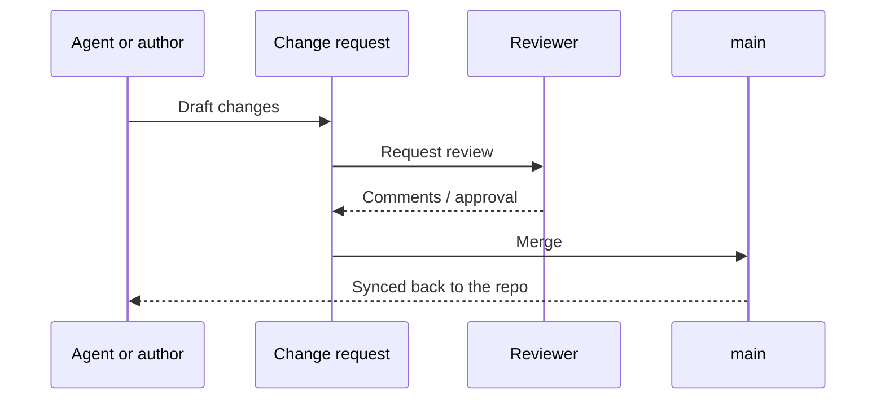

# Ownership and review

## Space ownership

| Space | Owner | Reviewers | Agent writes allowed |
|---|---|---|---|
| Home | Docs guild | Docs guild | No |
| Product Specs | Product | Feature PM + one engineer | Yes, via change request |
| Experiments | Product + Analytics | Experiment owner | Yes, via change request |
| Analytics | Analytics | Analytics lead | Yes, via change request |
| AI & Agents | Docs guild | Docs guild | No |
| Changelog | Product | Auto-merge for entries | Yes, auto-merged |

## How review works

Everything lands through a **change request** — whether it was written in the GitBook
editor, pushed from the repo, or drafted by an agent. A change request is reviewable,
commentable, and revertible.


**Review SLA is <code class="expression">space.vars.review_sla</code>.** A change request
older than that gets pinged automatically in
<code class="expression">space.vars.docs_owner</code>. Docs that wait a week for review
stop being written.


## What a reviewer is actually checking

Reviewers are not proofreaders. There are exactly four questions:

1. **Is it true in production today?** Not "was it true when the PRD was written".
2. **Is the surface named precisely enough to be unambiguous across products?**
3. **Are the links present** — analytics entry, affected experiments, changed spec?
4. **Did anything get deleted that should have been?** Superseded behaviour must go.

Style, wording and formatting are explicitly *not* blocking. Fix them inline and merge.

## The auto-merge exception

Changelog entries drafted by the release agent merge without human review. They are
append-only, they carry a link back to the spec, and a wrong entry is cheap to correct.

Everything else — including agent-drafted spec updates — requires a human approval. This is
the safeguard that lets us give agents write access at all.

## When someone edits in the GitBook UI

UI edits are exported back to the repository as commits. That means:


**Always pull `main` before pushing from a branch or a script.** A stale local copy of a
page that someone edited in GitBook will silently overwrite their work on merge, and the
diff will look entirely ordinary while it happens.

