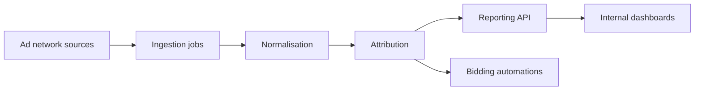

# AdConnect overview

AdConnect builds innovative solutions in performance marketing and digital product
development. Unlike Hily and Taimi, its "users" are internal marketing teams and partners —
which changes what a spec needs to contain.

## What an AdConnect spec documents

| Consumer app spec | AdConnect spec |
|---|---|
| Screens and taps | Pipelines, jobs and schedules |
| Per-user behaviour | Per-campaign and per-partner behaviour |
| Store entitlements | Partner contracts and attribution windows |
| Crash and drop-off | Data freshness and reconciliation |

## Surface map

## Behaviour that must always be specified


**Freshness and windows are behaviour, not implementation.** Every AdConnect spec states
the ingestion cadence, the attribution window, and what happens to numbers that arrive
after the window closes. These are the questions that actually get asked, and they are the
ones agents get wrong when the spec is silent.


| Property | Must be stated |
|---|---|
| Ingestion cadence | Per source, in the Surfaces table |
| Attribution window | Per partner, with the rule for late data |
| Restatement policy | Whether historical numbers can change, and for how long |
| Currency and timezone | Explicitly — never "the usual" |

## Specs

This space is intentionally thin today. Ingestion and attribution specs are being migrated
from Confluence; see the [Changelog](https://app.gitbook.com/s/XSPACE_CHANGELOG/) for
migration progress.

| Planned spec | Status |
|---|---|
| Source ingestion and cadence | Migrating |
| Attribution windows by partner | Migrating |
| Bidding automation rules | Not started |
