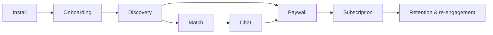

# Hily overview

Hily is a dating app that allows users to be truly themselves and enjoy dating as they are.
It is our largest product by daily active users and by experiment volume — most of what
runs in [Experiments](https://app.gitbook.com/s/XSPACE_EXPERIMENTS/) at any moment touches
a Hily surface.

## Surface map

| Surface | Spec | Owner |
|---|---|---|
| Onboarding | [Onboarding flow](onboarding-flow.md) | Product — Growth |
| Discovery & matching | [Matching and discovery](matching-and-discovery.md) | Product — Core |
| Paywall & subscriptions | [Subscriptions and paywalls](subscriptions-and-paywalls.md) | Product — Monetisation |
| Re-engagement | Delivered via Mailkeeper — see [Lifecycle campaigns](../mailkeeper/lifecycle-campaigns.md) | Product — Retention |

## Platforms

Hily ships on iOS, Android and a limited web experience. Unless a spec says otherwise,
**behaviour is identical across platforms** and any divergence is explicitly called out in
that spec's Surfaces table.


Web is read-mostly: profile viewing, chat and subscription management. Onboarding and
discovery are mobile-only. A spec that does not mention web does not apply to web.

