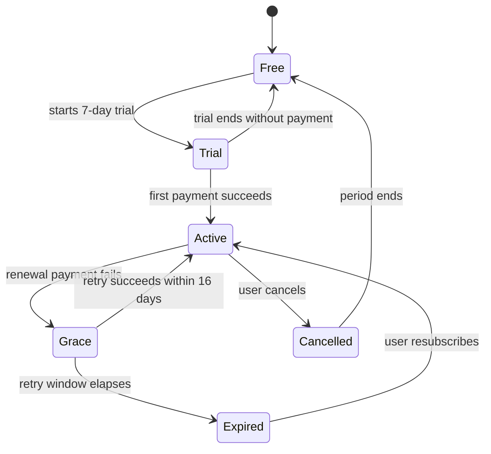

# Subscriptions and paywalls

## Summary

Hily monetises through an auto-renewing subscription sold on the App Store and Google Play.
The paywall is shown at defined moments rather than on a timer, and entitlement is resolved
server-side from store receipts so that it survives reinstalls and platform switches.

## Surfaces

| Platform | Surface | Entry point |
|---|---|---|
| iOS | `Paywall.Modal` | Post-first-match, feature gates, settings |
| Android | `PaywallActivity` | Post-first-match, feature gates, settings |
| Web | Manage subscription only | Account settings |

## Behaviour

| Condition | Paywall shown |
|---|---|
| New user, first match displayed | Yes, once, dismissible |
| Free user taps a premium-gated feature | Yes, contextual variant |
| Free user, third session of the calendar week | Yes, once per week |
| Free user, daily swipe limit reached | Yes, limit variant |
| Active subscriber | Never |
| Subscriber in grace period | Billing-issue banner, not the paywall |

### Subscription states

## Edge cases

| Situation | Behaviour |
|---|---|
| Receipt validation unavailable | Last known entitlement honoured for 48 hours |
| User subscribes on iOS, signs in on Android | Entitlement follows the account, not the device |
| Refund issued by the store | Entitlement revoked at next receipt refresh |
| Region without store billing | Paywall replaced with an unavailable notice |
| Family Sharing purchase | Honoured; treated as an individual entitlement |

## Configuration

| Key | Type | Default | Tunable without release |
|---|---|---|---|
| `pw_first_match_enabled` | bool | `true` | Yes |
| `pw_weekly_session_trigger` | int | `3` | Yes |
| `pw_trial_days` | int | `7` | Yes |
| `pw_grace_days` | int | `16` | No — store-governed |

## Measurement

Primary metric: **trial start rate per paywall view**.
Secondary: trial-to-paid conversion, D30 subscriber retention.

## Related


**Under test.** [EXP-2026-114](https://appflame.gitbook.io/appflame-knowledge-base/experiments/active/exp-2026-114-hily-paywall-timing)
is testing paywall placement at first match versus after the first sent message. Expect this
spec's Behaviour table to change when it concludes.


- Adjacent specs: [Matching and discovery](matching-and-discovery.md)
- Analytics: [metric definitions](https://appflame.gitbook.io/appflame-knowledge-base/analytics/foundations/metric-definitions)
