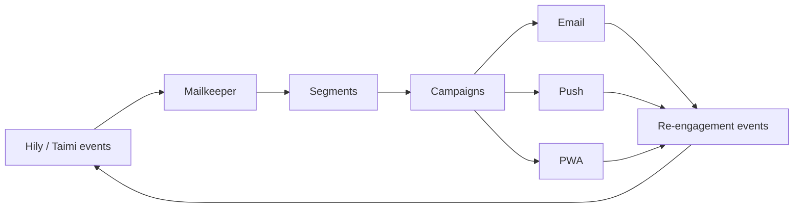

# Mailkeeper overview

Mailkeeper is a SaaS solution designed to improve user retention and increase overall
product revenue through email marketing, push notifications and PWA channels. It powers
re-engagement for Hily and Taimi, and is sold externally.

## Channel model

| Channel | Consent required | Typical latency | Primary use |
|---|---|---|---|
| Email | Opt-out (transactional), opt-in (marketing) | Minutes | Long-form re-engagement |
| Push | OS permission | Seconds | Time-sensitive nudges |
| PWA | Browser permission | Seconds | Web-first cohorts |


**Consent is per channel, never inherited.** A user who accepted push has not accepted
marketing email. Every Mailkeeper spec states which consent gate applies to the message it
describes.


## How Mailkeeper relates to the apps

Because the loop closes back into app analytics, **Mailkeeper campaign changes can move
app metrics**. Any experiment on a Mailkeeper campaign must declare the app metrics it
could affect — see
[experiment lifecycle](https://app.gitbook.com/s/XSPACE_EXPERIMENTS/lifecycle/experiment-lifecycle).

## Specs

| Surface | Spec | Owner |
|---|---|---|
| Lifecycle campaigns | [Lifecycle campaigns](lifecycle-campaigns.md) | Product — Retention |
| Segmentation | Migrating from Confluence | Product — Retention |
| Deliverability | Migrating from Confluence | Platform |
