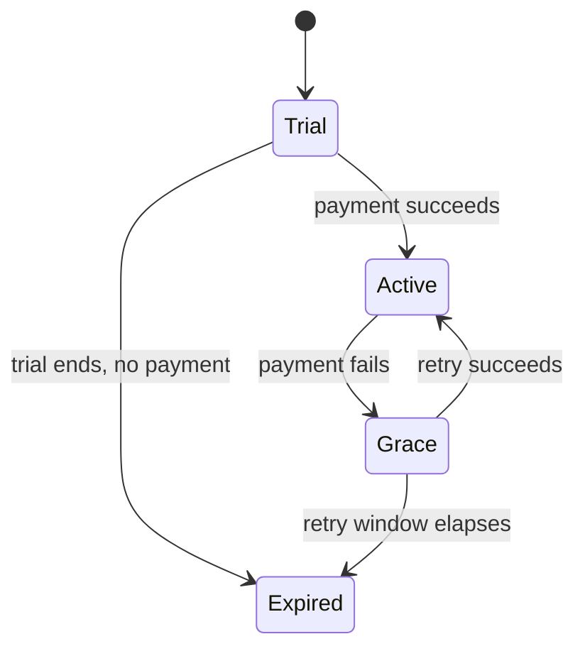

# Anatomy of a spec

Every spec page has the same seven sections, in the same order. The consistency is the
point: our agents are prompted against this shape, and a page that reorders or omits
sections retrieves badly.

## The seven sections

<table><thead><tr><th width="200">Section</th><th>Contains</th><th width="220">An agent uses it to…</th></tr></thead><tbody>
<tr><td><strong>1. Summary</strong></td><td>One paragraph: what the feature does and for whom.</td><td>Decide whether this page is relevant at all</td></tr>
<tr><td><strong>2. Surfaces</strong></td><td>Exact screens/endpoints, per platform.</td><td>Map a code change to a spec page</td></tr>
<tr><td><strong>3. Behaviour</strong></td><td>Conditions and outcomes, as a table.</td><td>Answer "what happens if…" questions</td></tr>
<tr><td><strong>4. Edge cases</strong></td><td>What happens when things are missing, late or wrong.</td><td>Avoid confidently inventing fallbacks</td></tr>
<tr><td><strong>5. Configuration</strong></td><td>Flags, thresholds, remote config keys.</td><td>Know what is tunable without a release</td></tr>
<tr><td><strong>6. Measurement</strong></td><td>Link to the analytics entry, plus the primary metric.</td><td>Connect behaviour to numbers</td></tr>
<tr><td><strong>7. Related</strong></td><td>Active experiments, adjacent specs, changelog.</td><td>Traverse the knowledge graph</td></tr>
</tbody></table>

## Frontmatter is part of the contract

```yaml
---
description: One sentence. Mandatory. Used by search and the assistant.
icon: heart
product: hily          # hily | taimi | adconnect | mailkeeper
surface: onboarding    # the top-level surface this spec belongs to
status: current        # current | under-test | stale
reviewed: 2026-09-02   # ISO date of last human confirmation
---
```


`reviewed` is not cosmetic. The staleness job flags any spec with `status: current` and a
`reviewed` date older than 90 days, and the docs agent will open a change request asking
the owner to confirm or correct it.


## Behaviour tables beat behaviour prose

The Behaviour section is a table, always. Prose hides conditions inside clauses; a table
forces every case to have a row, which is how missing cases become visible.



| Condition | Outcome |
|---|---|
| New user, onboarding complete, no photo | Photo prompt on first session |
| New user, onboarding complete, photo present | Straight to discovery |
| Returning user, photo removed since last session | Photo prompt, dismissible |



> New users are prompted to add a photo if they haven't got one, though returning users
> can dismiss the prompt, and obviously if they already have a photo they go straight to
> discovery.



## Optional sections

Two sections are optional and only appear where they earn their place:


Use a Mermaid `stateDiagram-v2` rather than describing transitions in prose. Subscription
status, moderation status and matching queue state all warrant one.

````markdown

````


{% expandable title="Rollout — when a feature is not yet at 100%" %}
A short table of population, percentage and target date. Delete the section once the
feature is fully rolled out; a permanent "rollout" section is a stale-docs generator.

